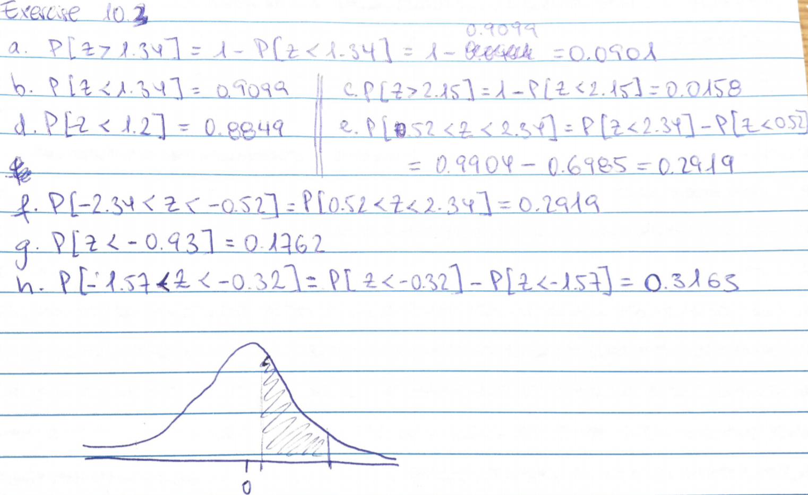
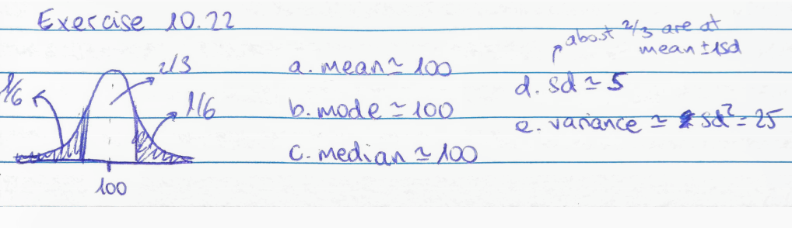

```{r setup, include=FALSE}
knitr::opts_chunk$set(echo = TRUE)
library(tidyverse)
```

##Getting familiarized with the normal distribution

Graph as in Fig 10.4.-1 the probability density function for three normal distribution with mean 0 and variance 1, 2, and 4. 

```{r}
n <- 100000
norm.distrib <- data.frame(var1 = rnorm(n), var2 = rnorm(n, sd = 2), var4 = rnorm(n, sd = 4))

ggplot(norm.distrib) +
    geom_density(aes(x = var1, color = "variance = 1")) +
    geom_density(aes(x = var2, color = "variance = 2")) +
    geom_density(aes(x = var4, color = "variance = 4")) +
    xlab("Z") + scale_color_hue(name = "Normal distribution density") +
    theme_minimal()
```

Do exercise 3 and 22 in ch10 in R / pencil and paper

###Exercise 10.3



###Exercise 10.22



##Using GC content to detect Lateral Gene Transfer

####Q1 Imagine a bacterial species has 2500 genes of 1000 bp each Assume that the GC content of each gene of the core genome is well approximated by a normal distribution with mean 0.35 and sd=0.05. Choose a threshold GC content below / above which you decide that the gene is recently transferred from another species. What is the probability that you will exclude a real core genome gene at that treshold?

```{r}
#low threshold = 0.2
#high threshold = 0.5
# 1 - P[Z < 0.5] - P[Z < 0.2]
1 - (pnorm(0.5, mean = 0.35, sd = 0.05) - pnorm(0.2, mean = 0.35, sd = 0.2))
```


####Q2 What is the probability of detecting a gene recently acquired by lateral gene transfer from another species 
with a GC content of 45% and 55% (assume the same sd as in the focal species)? Choose slightly different thresholds - more liberal and more conservative ones - and calculate how changing the treshold affects both probabilities

```{r}
pnorm(0.55, mean = 0.35, sd = 0.05) - pnorm(0.45, mean = 0.35, sd = 0.05)
pnorm(0.5, mean = 0.35, sd = 0.05) - pnorm(0.4, mean = 0.35, sd = 0.05)
pnorm(0.6, mean = 0.35, sd = 0.05) - pnorm(0.5, mean = 0.35, sd = 0.05)
```

####Q3 Import the Gc content of the species of bacteria X from GCContentBActeriaX.csv. Would a normal distribution be a good fit to the data? If so which normal distribution would you suggest to use ?

```{r}
gc.bacteriaX <- read.delim(file = "GCContentBActeriaX.csv", sep = ",")
ggplot(gc.bacteriaX, aes(x)) +
    geom_histogram() +
    theme_minimal()

mean(gc.bacteriaX$x)
sd(gc.bacteriaX$x)
```

>Yes, it can be approximated to a normal distribution of mean = 0.4 and sd = 0.06

We suspect that a fraction (presumably small i.e. < 10%) of the genome might be recently acquired genes from bacteria Y with a known GC content of mean 0.55 (and sd=0.05), The goal is to infer how many genes currently in X might come from Y.

To do that, calculate and graph (for the the range of GC content observed in the data): the probability PX(z) that a gene with gc content Z comes from X the probability PY(z) that a gene with gc content Z comes from Y A so called Bayes classifier is one that assigns a gene to X or Y according to the highest probability as calculated above. Applying the Bayes classifier, how many genes are inferred to come from the core genome of X and Y ?

```{r}

```

